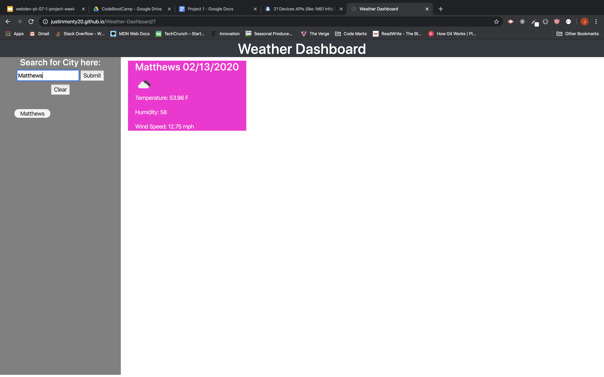
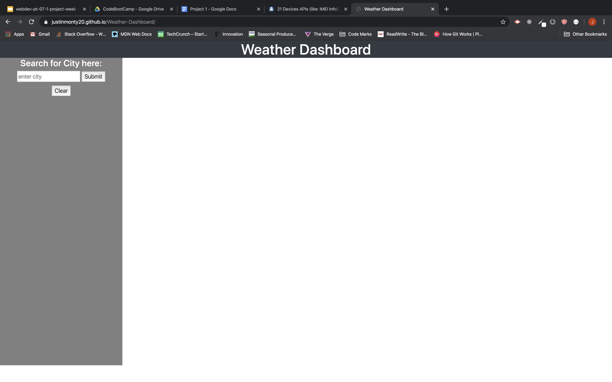

1. User will open the page and a search bar will be on the left instructing them to enter a city. 

2. When the user enters the city and submits then the main white area to the left of the search bar will be populated with some weather information. Temperature, Humidity, and Wind Speed. Along with a visual representation of the weather.  

3. Whatever city the user typed into the input. It will be stored in a list underneath the search bar.  

4. If the user wishes to see that city again then they can click on the list item of the city they wish to see and the weather dashboard will become repopulated with that city again. 

below is the link to my deployed website: 

https://justinmonty20.github.io/Weather-Dashboard/